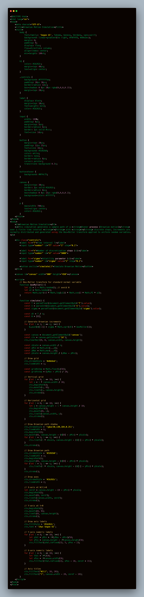

# CosimoLombardi2031075

## Brownian Motion Simulation: Theory and JavaScript Implementation

## Introduction

Brownian motion, also known as a Wiener process, is a fundamental stochastic process widely used in physics, mathematics, and finance. It models the random movement of particles suspended in a fluid, and it forms the basis for stochastic modeling in finance, such as the Black-Scholes model.

Formally, a standard Brownian motion W(t) satisfies:

1. **Initial condition:** W(0) = 0  
2. **Independent increments:** W(t) - W(s) is independent of the past for t > s  
3. **Normally distributed increments:** W(t) - W(s) follows a normal distribution with mean 0 and variance (t - s)  
4. **Continuous paths:** The function t -> W(t) is continuous almost surely  

Numerically, we approximate a continuous-time Brownian motion using discrete steps. For a total time interval T divided into n steps, each increment ΔW_i is computed as:

ΔW_i = sigma * sqrt(Δt) * Z_i

where:  
- Z_i is a standard normal random variable (mean 0, variance 1)  
- Δt = T / n  
- sigma is the volatility parameter

## Demo


<style>
        body {
            font-family: 'Segoe UI', Tahoma, Geneva, Verdana, sans-serif;
            background: linear-gradient(to right, #f0f4f8, #d9e2ec);
            margin: 0;
            padding: 0;
            display: flex;
            flex-direction: column;
            align-items: center;
            min-height: 100vh;
        }

        h1 {
            color: #1b262c;
            margin-top: 40px;
            text-align: center;
        }

        .controls {
            background: #ffffffaa;
            padding: 20px 30px;
            border-radius: 12px;
            box-shadow: 0 8px 20px rgba(0,0,0,0.15);
            margin-top: 20px;
        }

        label {
            display: block;
            margin-top: 10px;
            font-weight: bold;
            color: #1b262c;
        }

        input {
            width: 100%;
            padding: 8px;
            margin-top: 5px;
            border-radius: 6px;
            border: 1px solid #ccc;
            font-size: 14px;
        }

        button {
            margin-top: 20px;
            padding: 12px 25px;
            font-size: 16px;
            background: #3282b8;
            color: white;
            border: none;
            border-radius: 8px;
            cursor: pointer;
            transition: background 0.3s;
        }

        button:hover {
            background: #0f4c75;
        }

        canvas {
            margin-top: 30px;
            border: 2px solid #1b262c;
            border-radius: 8px;
            box-shadow: 0 8px 15px rgba(0,0,0,0.2);
            background-color: #ffffff;
        }

        p {
            max-width: 700px;
            text-align: center;
            color: #1b262c;
        }
    </style>

<body>
    <h1>Brownian Motion Simulation</h1>
    <p>This simulation generates a sample path of a <strong>Wiener process (Brownian motion)</strong> over a finite time interval <strong>T</strong> with <strong>n</strong> discrete steps. Increments are normally distributed and generated using the Box-Muller transform applied to uniform random variables.</p>

    <div class="controls">
        <label for="T">Time interval T:</label>
        <input type="number" id="T" value="1" step="0.1">

        <label for="n">Number of discretization steps (n):</label>
        <input type="number" id="n" value="5000">

        <label for="sigma">Volatility parameter (σ):</label>
        <input type="number" id="sigma" value="1" step="0.1">

        <button onclick="simulate()">Simulate Brownian Motion</button>
    </div>

    <canvas id="canvas" width="900" height="450"></canvas>

    <script>
        // Box-Muller transform for standard normal variable
        function boxMuller() {
            let u1 = 1 - Math.random(); // avoid 0
            let u2 = Math.random();
            return Math.sqrt(-2 * Math.log(u1)) * Math.cos(2 * Math.PI * u2);
        }

        function simulate() {
            const T = parseFloat(document.getElementById('T').value);
            const n = parseInt(document.getElementById('n').value);
            const sigma = parseFloat(document.getElementById('sigma').value);

            const dt = T / n;
            const W = [0];

            // Generate Brownian increments
            for (let i = 1; i <= n; i++) {
                W.push(W[i-1] + sigma * Math.sqrt(dt) * boxMuller());
            }

            const canvas = document.getElementById('canvas');
            const ctx = canvas.getContext('2d');
            ctx.clearRect(0, 0, canvas.width, canvas.height);

            const xScale = canvas.width / n;
            const yMin = Math.min(...W);
            const yMax = Math.max(...W);
            const yScale = canvas.height / (yMax - yMin);

            // Draw grid
            ctx.strokeStyle = '#e0e6ed';
            ctx.lineWidth = 1;

            const gridXstep = Math.floor(n/10);
            const gridYstep = (yMax - yMin) / 10;

            // Vertical grid
            for (let i = 0; i <= 10; i++) {
                let x = i * canvas.width / 10;
                ctx.beginPath();
                ctx.moveTo(x, 0);
                ctx.lineTo(x, canvas.height);
                ctx.stroke();
            }

            // Horizontal grid
            for (let i = 0; i <= 10; i++) {
                let y = canvas.height - i * canvas.height / 10;
                ctx.beginPath();
                ctx.moveTo(0, y);
                ctx.lineTo(canvas.width, y);
                ctx.stroke();
            }

            // Draw Brownian path shadow
            ctx.strokeStyle = 'rgba(50,130,184,0.25)';
            ctx.lineWidth = 6;
            ctx.beginPath();
            ctx.moveTo(0, canvas.height - (W[0] - yMin) * yScale);
            for (let i = 1; i <= n; i++) {
                ctx.lineTo(i * xScale, canvas.height - (W[i] - yMin) * yScale);
            }
            ctx.stroke();

            // Draw Brownian path
            ctx.strokeStyle = '#3282b8';
            ctx.lineWidth = 2;
            ctx.beginPath();
            ctx.moveTo(0, canvas.height - (W[0] - yMin) * yScale);
            for (let i = 1; i <= n; i++) {
                ctx.lineTo(i * xScale, canvas.height - (W[i] - yMin) * yScale);
            }
            ctx.stroke();

            // Draw axes
            ctx.strokeStyle = '#1b262c';
            ctx.lineWidth = 2;

            // X-axis at W(t)=0
            let zeroY = canvas.height - (0 - yMin) * yScale;
            ctx.beginPath();
            ctx.moveTo(0, zeroY);
            ctx.lineTo(canvas.width, zeroY);
            ctx.stroke();

            // Y-axis at t=0
            ctx.beginPath();
            ctx.moveTo(0, 0);
            ctx.lineTo(0, canvas.height);
            ctx.stroke();

            // Draw axis labels
            ctx.fillStyle = '#1b262c';
            ctx.font = '14px Segoe UI';

            // Y-axis numeric labels
            for (let i = 0; i <= 10; i++) {
                let yVal = yMin + i*(yMax - yMin)/10;
                let yPos = canvas.height - i*canvas.height/10;
                ctx.fillText(yVal.toFixed(2), 5, yPos - 2);
            }

            // X-axis numeric labels
            for (let i = 0; i <= 10; i++) {
                let tVal = i*T/10;
                let xPos = i*canvas.width/10;
                ctx.fillText(tVal.toFixed(2), xPos - 10, zeroY + 15);
            }

            // Axis titles
            ctx.fillText("W(t)", 10, 20);
            ctx.fillText("t", canvas.width - 20, zeroY - 10);
        }
    </script>
</body>


## Code



##  Code Implementation Overview

The simulation uses JavaScript and HTML5 `<canvas>` for visualization. It implements the Box-Muller transform to generate normally distributed random variables and draws the Brownian path on a canvas.  

---

###  Box-Muller Transform

The Box-Muller transform converts two uniform random numbers into a standard normal variable:

```js
function boxMuller() {
    let u1 = 1 - Math.random(); // avoid 0
    let u2 = Math.random();
    return Math.sqrt(-2 * Math.log(u1)) * Math.cos(2 * Math.PI * u2);
}
```


Ensures u1 is never zero to avoid log(0).

Returns one standard normal variable per call.


### Generating the Brownian Path
```js
const dt = T / n;
const W = [0]; // initial value

for (let i = 1; i <= n; i++) {
    W.push(W[i-1] + sigma * Math.sqrt(dt) * boxMuller());
}

```

W stores the path values.

Each increment is scaled by sqrt(dt) and the volatility sigma.

This is equivalent to the Euler discretization of a Wiener process.


---

### Scaling for Canvas
```js
const yMin = Math.min(...W);
const yMax = Math.max(...W);
const yScale = canvas.height / (yMax - yMin);
```

Converts Brownian values into pixel coordinates.

yMin and yMax normalize the vertical axis.


---

### Sampling for Large n
```js
const maxPixels = canvas.width;
const step = Math.max(1, Math.floor(n / maxPixels));
const sampledPoints = [];
for (let i = 0; i <= n; i += step) {
    sampledPoints.push({ x: i * canvas.width / n, y: canvas.height - (W[i] - yMin) * yScale });
}
```
Prevents drawing every point when n is very large.

Ensures the path remains visible on the canvas.


---

### Drawing the Grid
```js
ctx.strokeStyle = '#e0e6ed';
ctx.lineWidth = 1;

for (let i = 0; i <= 10; i++) {
    let x = i * canvas.width / 10;
    ctx.beginPath();
    ctx.moveTo(x, 0);
    ctx.lineTo(x, canvas.height);
    ctx.stroke();

    let y = i * canvas.height / 10;
    ctx.beginPath();
    ctx.moveTo(0, canvas.height - y);
    ctx.lineTo(canvas.width, canvas.height - y);
    ctx.stroke();
}
```
Adds light grid lines for reference.

Improves visual readability of the path.


---

### Drawing the Path
```js
ctx.strokeStyle = 'rgba(50,130,184,0.25)';
ctx.lineWidth = 6;
ctx.beginPath();
ctx.moveTo(sampledPoints[0].x, sampledPoints[0].y);
for (let pt of sampledPoints) ctx.lineTo(pt.x, pt.y);
ctx.stroke();

ctx.strokeStyle = '#3282b8';
ctx.lineWidth = 2;
ctx.beginPath();
ctx.moveTo(sampledPoints[0].x, sampledPoints[0].y);
for (let pt of sampledPoints) ctx.lineTo(pt.x, pt.y);
ctx.stroke();
```

Draws a semi-transparent shadow first, then the main path.

Enhances visual clarity.


---

### Axes and Labels

```js

const zeroY = canvas.height - (0 - yMin) * yScale;

// X-axis
ctx.beginPath();
ctx.moveTo(0, zeroY);
ctx.lineTo(canvas.width, zeroY);
ctx.stroke();

// Y-axis
ctx.beginPath();
ctx.moveTo(0, 0);
ctx.lineTo(0, canvas.height);
ctx.stroke();

// Labels
ctx.fillStyle = '#1b262c';
ctx.font = '14px Segoe UI';

// Y-axis numbers
for (let i = 0; i <= 10; i++) {
    let yVal = yMin + i*(yMax - yMin)/10;
    let yPos = canvas.height - i*canvas.height/10;
    ctx.fillText(yVal.toFixed(2), 5, yPos - 2);
}

// X-axis numbers
for (let i = 0; i <= 10; i++) {
    let tVal = i*T/10;
    let xPos = i*canvas.width/10;
    ctx.fillText(tVal.toFixed(2), xPos - 10, zeroY + 15);
}

// Axis titles
ctx.fillText("W(t)", 10, 20);
ctx.fillText("t", canvas.width - 20, zeroY - 10);

```
Draws x and y axes.

Adds numeric labels and axis titles.


---


