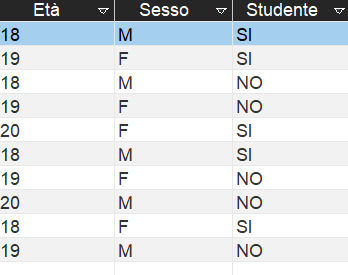
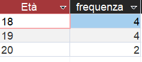
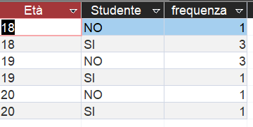

# CosimoLombardi2031075
# Dataset, distributions and some examples

#  Definition of a Dataset

A **dataset** is fundamentally a structured collection of data, typically organized in such a way that each piece of data is related to other pieces, enabling analysis and interpretation. In statistical, computational, and research contexts, a dataset represents **a set of observations or measurements** about a particular phenomenon, population, or process.

Formally, a dataset can be defined as:

> “A collection of data, usually represented in tabular form, where rows correspond to individual entities or observations and columns correspond to variables or attributes describing those entities.”

### Key Components of a Dataset

1. **Observations / Records / Instances**

   * Each row in a dataset represents a single observation, sample, or case.
   * Example: In a medical dataset, an observation might correspond to one patient.

2. **Variables / Features / Attributes**

   * Columns represent characteristics or properties of the observations.
   * Variables can be **quantitative** (numerical, e.g., age, income) or **qualitative** (categorical, e.g., gender, blood type).

3. **Values**

   * Each cell in the dataset contains a value for a specific variable for a specific observation.

4. **Metadata**

   * Metadata is “data about the data,” providing information on what each variable means, units of measurement, data source, or coding schema.

##  Types of Datasets

### a) Based on Structure

1. **Structured datasets**

   * Data is organized in rows and columns.
   * Example: Student grades table, sales records.

2. **Unstructured datasets**

   * Data lacks a predefined model or organization.
   * Examples: Text documents, images, videos.

3. **Semi-structured datasets**

   * Contains elements of both structured and unstructured data.
   * Examples: JSON, XML, or log files.

### b) Based on Measurement Type

1. **Quantitative datasets**

   * Variables are numeric, can be continuous (e.g., height) or discrete (e.g., number of siblings).

2. **Qualitative datasets**

   * Variables are categorical or descriptive, can be nominal or ordinal.

##  Importance of Datasets in Research

* **Empirical Basis:** Provides the foundation for analysis.
* **Reproducibility:** Allows other researchers to replicate studies.
* **Data-driven Decision Making:** Crucial for statistical inference, machine learning, and visualization.
* **Insight Discovery:** Identifies trends, correlations, anomalies, and causal relationships.

##  Typical Representation of a Dataset

```markdown
| Observation | Age | Gender | Blood Pressure | Cholesterol |
|------------|-----|--------|----------------|------------|
| 1          | 45  | M      | 130            | 200        |
| 2          | 50  | F      | 120            | 180        |
| 3          | 36  | M      | 110            | 210        |
```

* Rows = observations
* Columns = variables
* Cells = values

##  Dataset Quality and Preprocessing

* **Cleaning:** Remove missing, inconsistent, or duplicate entries.
* **Normalization/Standardization:** Scale variables.
* **Encoding:** Convert categorical variables to numerical.
* **Validation:** Ensure measurements are accurate and consistent.

##  Summary

A **dataset** is more than just a collection of numbers; it is the **structured representation of information** that allows researchers to formulate questions, analyze relationships, draw conclusions, and communicate findings. High-quality datasets are foundational for **rigorous, reproducible, and meaningful research**.

# Understanding the Concept of Distribution in Research

##  Definition of a Distribution

In statistics and research, a **distribution** refers to the way in which values of a variable are spread or dispersed across a dataset. It describes the frequency or probability of occurrence of different values or ranges of values of a variable. Distributions allow researchers to understand the behavior, variability, and patterns within the data.

Formally, a distribution can be defined as:

> “A representation, either in tabular, graphical, or mathematical form, that shows how often each value of a variable occurs within a dataset or population.”

---

##  Types of Distributions

### a) Based on Data Type

1. **Univariate Distribution**

   * Describes the frequency of a single variable.
   * Example: The distribution of ages of students in a classroom.

2. **Bivariate Distribution**

   * Describes the joint distribution of two variables, showing how combinations of values occur.
   * Example: The distribution of height and weight among individuals.

3. **Multivariate Distribution**

   * Describes the distribution of three or more variables simultaneously.
   * Used in complex analyses, like multivariate regression or principal component analysis.

### b) Based on Representation

1. **Frequency Distribution**

   * Lists each unique value or range (bin) and its count (frequency).
   * Can be represented in a table or histogram.

2. **Probability Distribution**

   * Assigns probabilities to each possible value or range.
   * Ensures that the sum of probabilities equals 1.

3. **Cumulative Distribution**

   * Shows the proportion or probability of observations less than or equal to a given value.

---

##  Key Concepts in Distributions

* **Frequency**: The number of times a particular value occurs.
* **Relative Frequency**: Frequency divided by total number of observations; also called empirical probability.
* **Probability Density Function (PDF)**: Describes the probability of a continuous variable falling within a particular range.
* **Cumulative Distribution Function (CDF)**: Gives the probability that a variable takes a value less than or equal to a certain threshold.

---

##  Importance of Distributions in Research

* **Understanding Data Behavior:** Reveals patterns, skewness, and variability.
* **Basis for Statistical Inference:** Many statistical methods rely on assumptions about the underlying distribution.
* **Data Visualization:** Helps in creating histograms, density plots, and scatter plots.
* **Comparison of Populations:** Allows researchers to compare distributions across groups or time periods.

---

##  Summary

A **distribution** is a fundamental concept in statistics that describes how values of a variable are spread across observations. Understanding distributions enables researchers to summarize data, identify patterns, and make informed inferences. Both univariate and multivariate distributions are essential for exploratory data analysis and advanced statistical modeling.


## Univariate and bivariate distribution on a dataset
Here is an example using a simple database created with Access DBMS. With two simple SQL queries, we can compute the univariate and bivariate distributions. The variables used are Età for the univariate distribution and Età and Studente for the bivariate distribution.
<br>

<br> <br>
Univariate distribution on Età 
```sql
SELECT
    Età,
    COUNT(*) AS frequenza
FROM
    Dati
GROUP BY
    Età
ORDER BY
    Età;
```



Bivariate distribution on Età, Studente
```sql
SELECT
    Età,
    Studente,
    COUNT(*) AS frequenza
FROM
    Dati
GROUP BY
    Età,
    Studente
ORDER BY
    Età,
    Studente;

```


## Using distribution to decrypt caesar cipher

This part of the document presents a small web-based tool and accompanying explanation for encrypting text with the classic Caesar cipher (shift = 3), performing brute‑force decryption (trying all 25 possible shifts), and performing an automatic decryption attempt using letter‑frequency analysis (chi‑squared goodness‑of‑fit) against English letter frequencies. The tool is implemented in plain HTML + JavaScript for educational use and experimentation. The frequency‑based method provides a statistical estimate of the most likely shift and works reliably only on sufficiently long texts; brute‑force always produces all candidate plaintexts and is therefore the fallback for short inputs.

---

## Goals

1. Demonstrate Caesar encryption (shift = 3).  
2. Show brute‑force decryption (all shifts 1–25).  
3. Implement an automatic estimator using letter frequency and the chi‑squared statistic to suggest the most likely shift for English text.  
4. Explain each code block step by step for educational purposes.

---


<h2>Letter Distribution and Caesar Cipher Demo</h2>

<form id="myForm">
  <input type="text" id="plaintext" size="50" placeholder="Enter text here">
  <input type="submit" value="Enter">
</form>

<script>
// english letter frequencies (english alphabet)
const freqEn = {
  A:8.17,B:1.49,C:2.78,D:4.25,E:12.70,F:2.23,G:2.02,H:6.09,I:6.97,J:0.15,K:0.77,L:4.03,M:2.41,
  N:6.75,O:7.51,P:1.93,Q:0.10,R:5.99,S:6.33,T:9.06,U:2.76,V:0.98,W:2.36,X:0.15,Y:1.97,Z:0.07
};

// Classic caesar cipher
function caesar(str, shift) {
  let result = '';
  for (let i = 0; i < str.length; i++) {
    let c = str[i];
    if (c.match(/[a-z]/i)) {
      let code = str.charCodeAt(i);
      let base = (code >= 65 && code <= 90) ? 65 : 97;
      result += String.fromCharCode(((code - base + shift) % 26) + base);
    } else {
      result += c;
    }
  }
  return result;
}

//  bruteforce decode
function cesareDecode(str, shift){
  let out='';
  for(const c of str){
    if(c.match(/[A-Z]/i)){
      const base = c===c.toUpperCase()?65:97;
      out += String.fromCharCode((c.charCodeAt(0)-base-shift+26)%26+base);
    } else out+=c;
  }
  return out;
}

function bruteForceDecode(text){
  const results = [];
  for(let shift=1; shift<26; shift++){
    results.push({shift, text: cesareDecode(text, shift)});
  }
  return results;
}

//  decode via distribution
function onlyLetters(s){
  return s.toUpperCase().replace(/[^A-Z]/g,'');
}

function letterCounts(s){
  const counts = Array(26).fill(0);
  const clean = onlyLetters(s);
  for(const ch of clean) counts[ch.charCodeAt(0)-65]++;
  return {counts, total: clean.length};
}

function freqPercent(counts, total){
  return counts.map(c => total? c*100/total: 0);
}

function chiSquared(obsPerc, expectedPerc){
  let chi = 0;
  for(let i=0;i<26;i++){
    const O = obsPerc[i], E = expectedPerc[i];
    if(E>0) chi += ((O-E)*(O-E))/E;
  }
  return chi;
}

function autoDecode(text){
  const {counts,total} = letterCounts(text);
  if(total===0) return {text:'',shift:0};

  const obsPerc = freqPercent(counts,total);
  const expectedArr = Object.keys(freqEn).map(k=>freqEn[k]);

  let bestShift=0, bestChi=Infinity;
  for(let shift=0; shift<26; shift++){
    const rotated = obsPerc.map((v,i)=>obsPerc[(i+shift)%26]);
    const chi = chiSquared(rotated, expectedArr);
    if(chi<bestChi){ bestChi=chi; bestShift=shift; }
  }

  return {text: cesareDecode(text,bestShift), shift: bestShift};
}

// Event listener form
document.getElementById('myForm').addEventListener('submit', function(e){
  e.preventDefault();

  const testo = document.getElementById('plaintext').value;
  if(!testo) return alert("Please enter some text!");

  // Classic Caesar shift 3
  const classicCipher = caesar(testo,3);

  // Brute-force
  const brute = bruteForceDecode(classicCipher);
  let bruteOutput = '';
  brute.forEach(r => bruteOutput += `Shift ${r.shift}:\n${r.text}\n\n`);

  // Auto decode via distribution
  const auto = autoDecode(classicCipher);

  //Letter distribution in the plaintext 
  const { counts, total } = letterCounts(testo);
  

  let distributionOutput = 'Letter distribution (count):\n\n';
  for (let i = 0; i < 26; i++) {
    const letter = String.fromCharCode(65 + i); // A to Z
    const count = counts[i];
    
    if (count > 0) {
      distributionOutput += `${letter}: ${count} occurrence(s)\n`;
    }
  }


  // shows result in multiple alerts
  alert(`Plaintext:\n${testo}`);
  alert(`Letter distribution:\n${distributionOutput}`);
  alert(`Classic Caesar Cipher (shift 3):\n${classicCipher}`);
  alert(`Brute-force (all shifts 1-25):\n${bruteOutput}`);
  alert(`Auto-decoded via frequency:\nShift estimated: ${auto.shift}\n${auto.text}`);
});
</script>


# Code and explanation


---
## Letter distribution of the plain text
```js
//Letter distribution in the plaintext 
  const { counts, total } = letterCounts(testo);
  

  let distributionOutput = 'Letter distribution (count):\n\n';
  for (let i = 0; i < 26; i++) {
    const letter = String.fromCharCode(65 + i); // A to Z
    const count = counts[i];
    
    if (count > 0) {
      distributionOutput += `${letter}: ${count} occurrence(s)\n`;
    }
  }

```

This code snippet uses the letterCounts function (defined later) to get the counts and total number of letters (A–Z) in the plaintext. It then builds a string listing each letter with its number of occurrences, including only those letters that appear at least once, effectively summarizing the absolute letter frequency distribution in the text.

##  Overview of the Caesar Cipher

The Caesar cipher is a **monoalphabetic substitution cipher** that shifts each letter of the plaintext by a fixed number of positions in the alphabet. For example, with a shift of 3:

```
Plaintext:  ABCDEFGHIJKLMNOPQRSTUVWXYZ
Ciphertext: DEFGHIJKLMNOPQRSTUVWXYZABC
```

Encryption replaces each letter with the one located *n* positions later in the alphabet, wrapping around at the end. Decryption reverses the process.

### Core function (encryption)

```js
function caesar(str, shift) {
  let result = '';
  for (let i = 0; i < str.length; i++) {
    let c = str[i];
    if (c.match(/[a-z]/i)) {
      let code = str.charCodeAt(i);
      let base = (code >= 65 && code <= 90) ? 65 : 97;
      result += String.fromCharCode(((code - base + shift) % 26) + base);
    } else {
      result += c;
    }
  }
  return result;
}
```

This function loops through every character, checks if it is a letter, converts it to its ASCII code, applies the shift, and wraps around the alphabet using modular arithmetic (`% 26`). Non-letter characters (spaces, punctuation) remain unchanged.

---

##  Brute-force Decryption

Since there are only **25 possible shifts**, the Caesar cipher can be easily broken by trying all possibilities. This is called a **brute-force attack**.

### Logic

For every possible shift value `1–25`, the program applies the reverse Caesar transformation and shows the result. The user can then visually inspect which output makes sense in English.

```js
for (let shift = 1; shift < 26; shift++) {
  results.push({shift, text: cesareDecode(text, shift)});
}
```

This step illustrates the **inherent weakness** of simple substitution ciphers — the limited keyspace.

---

##  Automatic Decryption via Frequency Analysis

The more advanced part of the code uses **distribution analysis** — comparing the letter frequency of the encrypted text with the expected frequency of English letters (A–Z).

### English frequency distribution

English letters appear with characteristic probabilities (e.g., E ≈ 12.7%, T ≈ 9.1%, A ≈ 8.2%). These frequencies form a statistical “fingerprint” of the language.
In the code, these values are stored in the freqEn object:
```js
const freqEn = {
  A:8.17,B:1.49,C:2.78,D:4.25,E:12.70,F:2.23,
  G:2.02,H:6.09,I:6.97,J:0.15,K:0.77,L:4.03,M:2.41,
  N:6.75,O:7.51,P:1.93,Q:0.10,R:5.99,S:6.33,
  T:9.06,U:2.76,V:0.98,W:2.36,X:0.15,Y:1.97,Z:0.07
};

```
These percentages represent the average frequency of each letter in English text and serve as the statistical baseline for the chi-squared comparison.

### Algorithm steps

1. Count occurrences of each letter in the ciphertext.
2. Compute observed letter frequencies.
3. Rotate this frequency distribution by every possible shift.
4. For each rotation, compute the **chi-squared statistic** against the reference English distribution.
5. The shift that minimizes the chi-squared value is the most likely key.

### Chi-squared test

The **chi-squared** value measures how far the observed frequencies deviate from expected ones:

```
χ² = Σ ((O - E)² / E)
```

where:

* `O` = observed percentage of a letter
* `E` = expected English percentage of that letter

A smaller χ² indicates a closer match — thus a better decryption candidate.

### Distribution usage code fragment 

```js
// Compute only uppercase letters
function onlyLetters(s){
return s.toUpperCase().replace(/[^A-Z]/g,'');
}


// Count occurrences of each letter
function letterCounts(s){
const counts = Array(26).fill(0);
const clean = onlyLetters(s);
for(const ch of clean) counts[ch.charCodeAt(0)-65]++;
return {counts, total: clean.length};
}


// Convert counts to percentages
function freqPercent(counts, total){
return counts.map(c => total ? c*100/total : 0);
}


// Chi-squared comparison
function chiSquared(obsPerc, expectedPerc){
let chi = 0;
for(let i=0;i<26;i++){
const O = obsPerc[i], E = expectedPerc[i];
if(E>0) chi += ((O-E)*(O-E))/E;
}
return chi;
}


// Automatic decoding based on distribution matching
function autoDecode(text){
const {counts,total} = letterCounts(text);
if(total===0) return {text:'',shift:0};


const obsPerc = freqPercent(counts,total);
const expectedArr = Object.keys(freqEn).map(k=>freqEn[k]);


let bestShift=0, bestChi=Infinity;
for(let shift=0; shift<26; shift++){
const rotated = obsPerc.map((v,i)=>obsPerc[(i+shift)%26]);
const chi = chiSquared(rotated, expectedArr);
if(chi<bestChi){ bestChi=chi; bestShift=shift; }
}


return {text: cesareDecode(text,bestShift), shift: bestShift};
}
```

These helper functions and the frequency table allow the program to analyze the statistical profile of the encrypted text, compare it to English, and identify the most probable shift value automatically.

---

##  Integration with the Web Form

The HTML interface provides a text input and uses JavaScript event listeners to handle encryption and decryption:

1. **User inputs text**.
2. The script encrypts it with shift 3.
3. Then, it runs both brute-force and automatic decryption methods.
4. The results (ciphertext, all possible plaintexts, and the statistically best guess) are displayed via alert boxes.

This provides an interactive demonstration of both cryptographic theory and frequency analysis.

---

##  Algorithmic Summary

| Stage                  | Method                    | Description                                                |
| ---------------------- | ------------------------- | ---------------------------------------------------------- |
| Encryption             | Fixed shift (Caesar)      | Substitution cipher using modular arithmetic               |
| Brute-force Decryption | Exhaustive search         | Tests all 25 possible shifts                               |
| Automatic Decryption   | Statistical (chi-squared) | Estimates the most likely key using frequency distribution |

---

##  Cryptographic Implications

The Caesar cipher is **historically important** but **cryptographically obsolete**. It demonstrates the core idea of substitution ciphers but fails against modern analysis:

* **Small keyspace** (only 25 possible keys)
* **Predictable frequency patterns**
* **No resistance to statistical attacks**

However, it remains valuable for **educational and historical** purposes and as an introduction to the relationship between **language statistics** and **encryption security**.

---

##  Conclusion

The implemented code illustrates three essential concepts in classical cryptography:

1. **Simple substitution encryption** (Caesar cipher)
2. **Brute-force key recovery**
3. **Frequency-based statistical decryption**

This exercise connects cryptographic theory with **distribution analysis**, showing how statistical reasoning can uncover hidden information. The algorithm highlights the transition from classical to modern cryptanalysis — from guessing keys to understanding data distributions.


