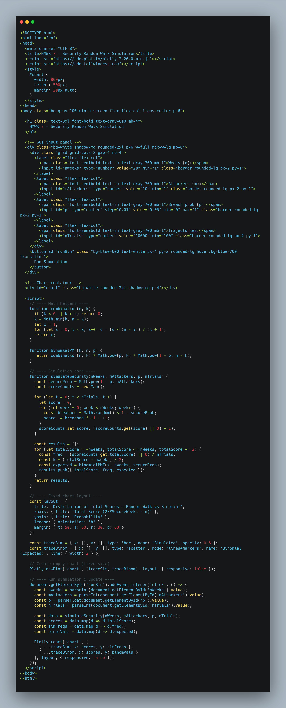

# CosimoLombardi2031075

---

## Homework7
<<<<<<< HEAD
=======


>>>>>>> bd7f5ee4920d6136b9bc0b907ac3b929687c77c4

A server receives weekly security updates for `n` weeks. Each week there are `m` attackers, each with a probability `p` of breaching the system independently. For every week:

* Assign `+1` if **no attacker** succeeds (the server remains secure),
* Assign `−1` if **at least one attacker** succeeds (the server is breached).

Each trajectory represents the cumulative score of these ±1 events over `n` weeks — a **random walk**. By repeating this experiment for many simulated trajectories, we can count how many end at each possible final score, then compare the empirical distribution with the **binomial distribution** predicted by theory.

---

<<<<<<< HEAD


###  Probability of a Secure Week
=======
### Probability of a Secure Week
>>>>>>> bd7f5ee4920d6136b9bc0b907ac3b929687c77c4

If each of the `m` attackers acts independently with breach probability `p`, then the probability that the system remains secure for a week is:

**P_secure = (1 − p)^m**

and the probability that at least one breach occurs is:

**P_breach = 1 − (1 − p)^m**

---

### Distribution of Secure Weeks

Over `n` weeks, each week is an independent Bernoulli trial with success probability `P_secure`.  
The number of secure weeks `K` therefore follows a **binomial distribution**:

**K ∼ Binomial(n, P_secure)**

---

### Mapping to a Random Walk

Each secure week corresponds to a step of `+1`, and each breach corresponds to `−1`.  
After `n` weeks, the total cumulative score is:

**S = (+1)K + (−1)(n − K) = 2K − n**

The possible values of `S` are `−n, −n + 2, …, n − 2, n`.  
Each score maps to a unique number of secure weeks through:

**K = (S + n) / 2**

---

### Theoretical Distribution of Total Scores

The theoretical probability that the total score equals `s` is the probability that `K = (s + n) / 2` in the binomial distribution:

**P(S = s) = C(n, k) · (P_secure)^k · (1 − P_secure)^(n − k)**  
where **k = (s + n) / 2**

Here, **C(n, k)** represents the binomial coefficient *“n choose k”*.

---

### Asymptotic Behavior

- As `n` becomes very large, the binomial distribution approaches a **normal distribution** (Central Limit Theorem) with  
  **mean μ = n · P_secure** and **variance σ² = n · P_secure · (1 − P_secure)**.
- As `m` increases, `P_secure = (1 − p)^m` decreases rapidly, so breaches become more likely and the distribution shifts left.
- As `p → 0`, `P_secure → 1`, concentrating the distribution at high positive scores.

---

## Simulation Strategy

To simulate the experiment:

1. Compute **P_secure = (1 − p)^m**.
2. For each trajectory (repeat `nTrials` times):
   - Set **score = 0**.
   - Repeat for `n` weeks:
     - Draw a random number **u ∼ Uniform(0,1)**.
     - If **u < 1 − P_secure**, a breach occurs → **score −= 1**.
     - Otherwise → **score += 1**.
   - Record the final score.
3. Normalize the counts by dividing by the total number of trials to obtain empirical probabilities.
4. Compute the theoretical binomial probabilities for the same possible scores.
5. Compare the two distributions.

This process directly represents a **biased random walk**.

---

## Computational Considerations

- **Complexity**: Each trajectory requires `n` random draws, so the computational cost is proportional to `O(n × nTrials)`.
- **Numerical stability**: Calculating large binomial coefficients directly (using factorials) can overflow; iterative computation is safer.
- **Efficiency**: For very large simulations, one could draw `K` directly from a binomial distribution instead of simulating week by week, but the current approach better illustrates the random-walk dynamics.

---

## Demo, code and code explanations

<style>

.sim-container {
  max-width: 1200px;
  margin: 0 auto;
}
.settings {
  background: #1e293b;
  padding: 16px;
  border-radius: 10px;
  margin-bottom: 16px;
}
.controls label {
  margin-right: 6px;
}
.controls input,
.controls select {
  margin-right: 12px;
  margin-bottom: 8px;
  padding: 4px;
  border-radius: 4px;
  border: 1px solid #334155;
  background: #0f172a;
  color: #f8fafc;
}
.buttons {
  margin-top: 10px;
}
button {
  background: #2563eb;
  color: #fff;
  padding: 6px 12px;
  border: none;
  border-radius: 6px;
  cursor: pointer;
}
button.danger {
  background: #dc2626;
}
.card {
  background: #1e293b;
  padding: 14px;
  border-radius: 10px;
  margin-bottom: 16px;
}
.legend {
  font-size: 0.9rem;
  color: #cbd5e1;
  margin-bottom: 6px;
}
canvas {
  width: 100%;
  height: 300px;
  display: block;
}
table {
  width: 100%;
  border-collapse: collapse;
  color: #e2e8f0;
  margin-top: 8px;
  font-size: 0.9rem;
}
th, td {
  padding: 4px 8px;
  border-bottom: 1px solid #334155;
  text-align: center;
}
th:first-child, td:first-child {
  text-align: left;
}
</style>


<body>
<div class="sim-container">
  <div class="settings">
    <div class="controls">
      <label>Weeks</label><input id="weeks" type="number" min="1" value="80">
      <label>Attackers</label><input id="attackers" type="number" min="1" value="5">
      <label>p (per attacker)</label><input id="pval" type="number" min="0" max="1" step="0.01" value="0.30">
      <label>Runs</label><input id="runs" type="number" min="1" value="6000">
      <label>Animate</label>
      <select id="animate"><option value="true">Yes</option><option value="false" selected>No</option></select>
      <label>Batch size</label><input id="batch" type="number" min="1" value="500">
      <label>Paths shown</label><input id="keep" type="number" min="0" value="400">
    </div>
    <div class="buttons">
      <button id="run">Run</button>
      <button id="clear" class="danger">Clear</button>
    </div>
    <div id="run-info" class="legend"></div>
    <div id="run-stats" class="legend"></div>
  </div>

  <div class="card">
    <h3>Random Walk Trajectories</h3>
    <p class="legend">Each line is a ±1 random walk. The drift = E[X] = 1 − 2q, where q is weekly breach probability.</p>
    <canvas id="walkCanvas" width="1200" height="300"></canvas>
  </div>

  <div class="card">
    <h3>Endpoint Distribution (t = n)</h3>
    <p class="legend">Bars show empirical frequencies, green line is theoretical Binomial(n,q).</p>
    <canvas id="histCanvas" width="1200" height="300"></canvas>
    <div id="tableWrap" class="legend" style="margin-top:10px">Run the simulation to see results.</div>
  </div>
</div>

<script>
// ===== Canvas setup (HiDPI safe) =====
function prepareCanvas(canvas) {
  const dpr = window.devicePixelRatio || 1;
  const rect = canvas.getBoundingClientRect();
  const w = Math.floor(rect.width * dpr);
  const h = Math.floor(rect.height * dpr);
  if (canvas.width !== w || canvas.height !== h) {
    canvas.width = w;
    canvas.height = h;
  }
  const ctx = canvas.getContext("2d");
  ctx.setTransform(dpr, 0, 0, dpr, 0, 0);
  return { ctx, width: rect.width, height: rect.height };
}

// ===== Math utilities =====
const clamp = (x, a, b) => Math.max(a, Math.min(x, b));

function choose(n, k) {
  if (k < 0 || k > n) return 0;
  if (k === 0 || k === n) return 1;
  k = Math.min(k, n - k);
  let res = 1;
  for (let i = 1; i <= k; i++) {
    res = (res * (n - k + i)) / i;
  }
  return res;
}

function binomialPMF(n, q) {
  const p = new Float64Array(n + 1);
  for (let k = 0; k <= n; k++) {
    p[k] = choose(n, k) * Math.pow(q, k) * Math.pow(1 - q, n - k);
  }
  return p;
}

// ===== Simulation =====
function simulateWalks(n, runs, q, keep) {
  const kept = Math.min(keep, runs);
  const paths = new Array(kept);
  for (let i = 0; i < kept; i++) {
    paths[i] = new Int16Array(n + 1);
  }
  const counts = new Map();

  for (let r = 0; r < runs; r++) {
    let s = 0;
    const store = r < kept;
    if (store) paths[r][0] = 0;
    for (let t = 1; t <= n; t++) {
      s += Math.random() < q ? -1 : 1;
      if (store) paths[r][t] = s;
    }
    counts.set(s, (counts.get(s) || 0) + 1);
  }

  return { paths, counts };
}

// ===== Drawing functions (with axis ticks + values) =====
function drawPaths(paths, canvas) {
  const { ctx, width, height } = prepareCanvas(canvas);
  ctx.clearRect(0, 0, width, height);
  if (!paths.length) return;

  const n = paths[0].length - 1;
  const pad = { left: 50, right: 10, top: 10, bottom: 30 };
  const W = width - pad.left - pad.right;
  const H = height - pad.top - pad.bottom;
  const x0 = pad.left, y0 = height - pad.bottom;

  // determine min & max
  let minY = 0, maxY = 0;
  for (const p of paths) {
    for (let t = 0; t <= n; t++) {
      minY = Math.min(minY, p[t]);
      maxY = Math.max(maxY, p[t]);
    }
  }
  if (minY === maxY) { minY--; maxY++; }

  const sx = W / n;
  const sy = H / (maxY - minY);

  // draw axes
  ctx.strokeStyle = "#e2e8f0"; ctx.lineWidth = 1;
  // X-axis
  ctx.beginPath(); ctx.moveTo(x0, y0); ctx.lineTo(x0 + W, y0); ctx.stroke();
  // Y-axis
  ctx.beginPath(); ctx.moveTo(x0, y0); ctx.lineTo(x0, y0 - H); ctx.stroke();

  // draw ticks + labels on X-axis: 0, n/2, n
  ctx.fillStyle = "#f8fafc";
  ctx.font = "12px system-ui, sans-serif";
  ctx.textAlign = "center"; ctx.textBaseline = "top";
  const xticks = [0, Math.floor(n/2), n];
  for (const t of xticks) {
    const x = x0 + t * sx;
    ctx.beginPath();
    ctx.moveTo(x, y0);
    ctx.lineTo(x, y0 + 6);
    ctx.stroke();
    ctx.fillText(`${t}`, x, y0 + 8);
  }

  // ticks + labels on Y-axis: minY, 0 (if between), maxY
  ctx.textAlign = "right"; ctx.textBaseline = "middle";
  const yticks = [minY, 0, maxY].filter((v, i, arr) => (i===0 || i===arr.length-1 || v===0));
  for (const v of yticks) {
    const y = y0 - (v - minY) * sy;
    ctx.beginPath();
    ctx.moveTo(x0 - 6, y);
    ctx.lineTo(x0, y);
    ctx.stroke();
    ctx.fillText(`${v}`, x0 - 8, y);
  }

  // draw paths
  ctx.globalAlpha = 0.7;
  for (const p of paths) {
    const grad = ctx.createLinearGradient(x0, 0, x0 + W, 0);
    grad.addColorStop(0, "#93c5fd");
    grad.addColorStop(1, "#a7f3d0");
    ctx.strokeStyle = grad; ctx.lineWidth = 0.8;
    ctx.beginPath();
    for (let t = 0; t <= n; t++) {
      const x = x0 + t * sx;
      const y = y0 - (p[t] - minY) * sy;
      if (t === 0) ctx.moveTo(x, y);
      else ctx.lineTo(x, y);
    }
    ctx.stroke();
  }
  ctx.globalAlpha = 1;
}

function drawHistogram(counts, n, R, pmf, canvas) {
  const { ctx, width, height } = prepareCanvas(canvas);
  ctx.clearRect(0, 0, width, height);

  const pad = { left: 50, right: 10, top: 10, bottom: 30 };
  const W = width - pad.left - pad.right;
  const H = height - pad.top - pad.bottom;
  const x0 = pad.left, y0 = height - pad.bottom;

  const scores = [];
  for (let s = -n; s <= n; s += 2) scores.push(s);

  const barW = W / (scores.length + 2);
  let maxFreq = 0;
  for (const s of scores) {
    const f = (counts.get(s) || 0) / R;
    if (f > maxFreq) maxFreq = f;
  }
  if (maxFreq === 0) maxFreq = 1;

  const yOf = f => y0 - f * (H / maxFreq);
  const xOf = s => x0 + ((s + n) / 2) * barW;

  // axes
  ctx.strokeStyle = "#e2e8f0"; ctx.lineWidth = 1;
  ctx.beginPath(); ctx.moveTo(x0, y0); ctx.lineTo(x0 + W, y0); ctx.stroke();
  ctx.beginPath(); ctx.moveTo(x0, y0 - H); ctx.lineTo(x0, y0); ctx.stroke();

  // ticks + labels X-axis: min s, 0, max s
  ctx.fillStyle = "#f8fafc";
  ctx.font = "12px system-ui, sans-serif";
  ctx.textAlign = "center"; ctx.textBaseline = "top";
  const smin = -n, smax = n;
  const xticks = [smin, 0, smax];
  for (const s of xticks) {
    const x = xOf(s);
    ctx.beginPath();
    ctx.moveTo(x, y0);
    ctx.lineTo(x, y0 + 6);
    ctx.stroke();
    ctx.fillText(`${s}`, x, y0 + 8);
  }

  // ticks + labels Y-axis: freq 0, maxFreq
  ctx.textAlign = "right"; ctx.textBaseline = "middle";
  const ytickvals = [0, maxFreq];
  for (const f of ytickvals) {
    const y = yOf(f);
    ctx.beginPath();
    ctx.moveTo(x0 - 6, y);
    ctx.lineTo(x0, y);
    ctx.stroke();
    ctx.fillText(f.toFixed(2), x0 - 8, y);
  }

  // empirical bars
  ctx.fillStyle = "#ffffff";
  for (const s of scores) {
    const f = (counts.get(s) || 0) / R;
    const x = xOf(s);
    const y = yOf(f);
    ctx.fillRect(x - barW * 0.4, y, barW * 0.8, y0 - y);
  }

  // theoretical line
  ctx.strokeStyle = "#22c55e";
  ctx.lineWidth = 2;
  ctx.beginPath(); let first = true;
  for (let k = 0; k <= n; k++) {
    const s = n - 2*k;
    const x = xOf(s);
    const y = yOf(pmf[k]);
    if (first) { ctx.moveTo(x, y); first = false; }
    else ctx.lineTo(x, y);
  }
  ctx.stroke();
}

// ===== Table and metrics =====
function updateTable(counts, n, R, pmf) {
  let html = `<table><thead><tr><th>s = n−2k</th><th>k</th><th>Count</th><th>Empirical</th><th>Theoretical</th></tr></thead><tbody>`;
  for (let k = 0; k <= n; k++) {
    const s = n - 2*k;
    const c = counts.get(s) || 0;
    const f = c / R;
    html += `<tr><td>${s}</td><td>${k}</td><td>${c}</td><td>${f.toFixed(4)}</td><td>${pmf[k].toFixed(4)}</td></tr>`;
  }
  html += `</tbody></table>`;
  document.getElementById("tableWrap").innerHTML = html;
}

function totalVariation(counts, n, R, pmf) {
  let tv = 0;
  for (let k = 0; k <= n; k++) {
    const s = n - 2*k;
    const f = (counts.get(s) || 0) / R;
    tv += Math.abs(f - pmf[k]);
  }
  return 0.5 * tv;
}

// ===== Main control logic =====
const walkCanvas = document.getElementById("walkCanvas");
const histCanvas = document.getElementById("histCanvas");
let lastState = {};

document.getElementById("run").addEventListener("click", async () => {
  const n = clamp(parseInt(document.getElementById("weeks").value,10) || 0, 1, 20000);
  const m = clamp(parseInt(document.getElementById("attackers").value,10) || 0, 1, 100000);
  const p = clamp(parseFloat(document.getElementById("pval").value) || 0, 0, 1);
  const R = clamp(parseInt(document.getElementById("runs").value,10) || 0, 1, 200000);
  const keep = clamp(parseInt(document.getElementById("keep").value,10) || 0, 0, R);
  const animate = (document.getElementById("animate").value === "true");
  const batch = clamp(parseInt(document.getElementById("batch").value,10) || 500, 1, 10000);

  const q = 1 - Math.pow(1 - p, m);
  const pmf = binomialPMF(n, q);

  document.getElementById("run-info").innerHTML =
    `n = <b>${n}</b>, m = <b>${m}</b>, p = <b>${p.toFixed(3)}</b> → q = <b>${q.toFixed(6)}</b>, runs = <b>${R}</b>.`;

  if (!animate) {
    const { paths, counts } = simulateWalks(n, R, q, keep);
    drawPaths(paths, walkCanvas);
    drawHistogram(counts, n, R, pmf, histCanvas);
    updateTable(counts, n, R, pmf);
    const tv = totalVariation(counts, n, R, pmf);
    document.getElementById("run-stats").innerHTML =
      `Total variation distance = <b>${tv.toFixed(5)}</b>`;
    lastState = { paths, counts, n, R, pmf, q };
    return;
  }

  // Animated mode
  let acc = new Map(), drawn = [], done = 0;
  while (done < R) {
    const chunk = Math.min(batch, R - done);
    const { paths, counts } = simulateWalks(n, chunk, q, Math.min(keep, 150));
    for (const [s,c] of counts.entries()) {
      acc.set(s, (acc.get(s) || 0) + c);
    }
    drawn = drawn.concat(paths).slice(-keep);
    done += chunk;

    drawPaths(drawn, walkCanvas);
    drawHistogram(acc, n, done, pmf, histCanvas);
    updateTable(acc, n, done, pmf);
    const tv = totalVariation(acc, n, done, pmf);
    document.getElementById("run-stats").innerHTML =
      `Runs: ${done} / ${R} | Total variation = <b>${tv.toFixed(5)}</b>`;

    lastState = { paths: drawn, counts: new Map(acc), n, R: done, pmf, q };
    await new Promise(r => setTimeout(r, 70));
  }
});

document.getElementById("clear").addEventListener("click", () => {
  const { ctx: c1, width: w1, height: h1 } = prepareCanvas(walkCanvas);
  c1.clearRect(0, 0, w1, h1);
  const { ctx: c2, width: w2, height: h2 } = prepareCanvas(histCanvas);
  c2.clearRect(0, 0, w2, h2);
  document.getElementById("tableWrap").textContent = "Cleared.";
  document.getElementById("run-info").textContent = "";
  document.getElementById("run-stats").textContent = "";
  lastState = {};
});

window.addEventListener("resize", () => {
  if (!lastState.n) return;
  const { paths, counts, n, R, pmf } = lastState;
  if (paths?.length) drawPaths(paths, walkCanvas);
  if (pmf?.length) drawHistogram(counts, n, R, pmf, histCanvas);
});
</script>

</body>




---

##   Canvas Preparation (HiDPI-safe Rendering)
```js
function prepareCanvas(canvas) {
  const dpr = window.devicePixelRatio || 1;
  const rect = canvas.getBoundingClientRect();
  const w = Math.floor(rect.width * dpr);
  const h = Math.floor(rect.height * dpr);
  if (canvas.width !== w || canvas.height !== h) {
    canvas.width = w;
    canvas.height = h;
  }
  const ctx = canvas.getContext("2d");
  ctx.setTransform(dpr, 0, 0, dpr, 0, 0);
  return { ctx, width: rect.width, height: rect.height };
}
```
**Purpose:** ensures the canvas renders correctly on high-resolution displays by adjusting for device pixel ratio.

---

##  Mathematical Utilities
```js
const clamp = (x, a, b) => Math.max(a, Math.min(x, b));

function choose(n, k) {
  if (k < 0 || k > n) return 0;
  if (k === 0 || k === n) return 1;
  k = Math.min(k, n - k);
  let res = 1;
  for (let i = 1; i <= k; i++) res = (res * (n - k + i)) / i;
  return res;
}

function binomialPMF(n, q) {
  const p = new Float64Array(n + 1);
  for (let k = 0; k <= n; k++) {
    p[k] = choose(n, k) * Math.pow(q, k) * Math.pow(1 - q, n - k);
  }
  return p;
}
```
- **`choose(n, k)`** computes the binomial coefficient efficiently.
- **`binomialPMF`** returns the theoretical Binomial(n, q) probabilities for comparison.

---

##  Simulation Engine
```js
function simulateWalks(n, runs, q, keep) {
  const kept = Math.min(keep, runs);
  const paths = new Array(kept);
  for (let i = 0; i < kept; i++) paths[i] = new Int16Array(n + 1);
  const counts = new Map();

  for (let r = 0; r < runs; r++) {
    let s = 0;
    const store = r < kept;
    if (store) paths[r][0] = 0;
    for (let t = 1; t <= n; t++) {
      s += Math.random() < q ? -1 : 1;
      if (store) paths[r][t] = s;
    }
    counts.set(s, (counts.get(s) || 0) + 1);
  }
  return { paths, counts };
}
```
**Explanation:**
- Runs multiple **random walks** of length `n`.
- Each step adds +1 or −1 depending on whether the server is secure or breached.
- Stores a limited number of paths (`keep`) for plotting and records the final scores in a frequency map `counts`.

---

##  Visualization
### a. Random Walk Trajectories
```js
function drawPaths(paths, canvas) { ... }
```
- Plots each simulated path over time.
- X-axis = week index (0 → n)  
- Y-axis = cumulative score \( S_t \)
- Uses automatic scaling, soft colors, and transparency for overlapping lines.
- Includes labeled axes for both time and score values.

###  Endpoint Distribution
```js
function drawHistogram(counts, n, R, pmf, canvas) { ... }
```
- Draws the empirical histogram of final scores.
- Overlays the **theoretical binomial PMF** in green.
- X-axis: total score \( S_n \)  
- Y-axis: relative frequency \( P(S_n) \)

---

##  Statistical Analysis
### a. Data Table
```js
function updateTable(counts, n, R, pmf) { ... }
```
Creates a table showing:
| Symbol | Meaning |
|--------|----------|
| s = n−2k | Final cumulative score |
| k | Number of breaches |
| Empirical freq | Observed probability |
| Theoretical | Binomial probability |

### b. Total Variation Distance
```js
function totalVariation(counts, n, R, pmf) {
  let tv = 0;
  for (let k = 0; k <= n; k++) {
    const s = n - 2*k;
    const f = (counts.get(s) || 0) / R;
    tv += Math.abs(f - pmf[k]);
  }
  return 0.5 * tv;
}
```
Measures how close the empirical distribution is to the theoretical binomial law:
\[ TV = \frac{1}{2} \sum_k |f_{emp}(k) - f_{theory}(k)| \]

---

##  Controller Logic
### a. Parameter Handling
On clicking **Run**, the code reads user inputs:
- `n`: number of weeks  
- `m`: number of attackers  
- `p`: breach probability per attacker  
- `R`: number of simulations  

It computes the **aggregate breach probability per week** as:
\[ q = 1 - (1 - p)^m \]

### b. Simulation Flow
1. Compute the theoretical Binomial(n, q).  
2. Run the random walk simulation.  
3. Plot trajectories and histograms.  
4. Display the convergence metric (total variation distance).

---

##  Mathematical Interpretation

### Expected Value
Each week contributes either +1 (secure) or −1 (breached).  
Let \( X_i \) be the weekly increment, then:
\[ E[X_i] = (1 - q)(+1) + q(-1) = 1 - 2q \]
and the total score after n weeks is:
\[ E[S_n] = n(1 - 2q) \]

### Variance
Since steps are independent:
\[ Var[S_n] = 4nq(1 - q) \]

Thus, for large n, the empirical distribution of \( S_n \) approaches a **Normal distribution** with:
\[ S_n \approx N(n(1 - 2q), 4nq(1 - q)) \]

---


##  Conclusion
The JavaScript code fully models a **stochastic process** equivalent to a symmetric or biased random walk, where drift and variance depend on the attackers’ success probability. By comparing the simulated results to the **Binomial(n, q)** distribution, we can quantify convergence and visualize how randomness manifests in finite systems.

---


